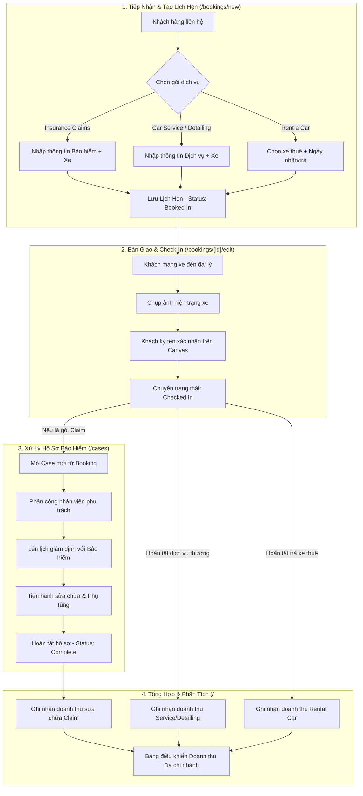
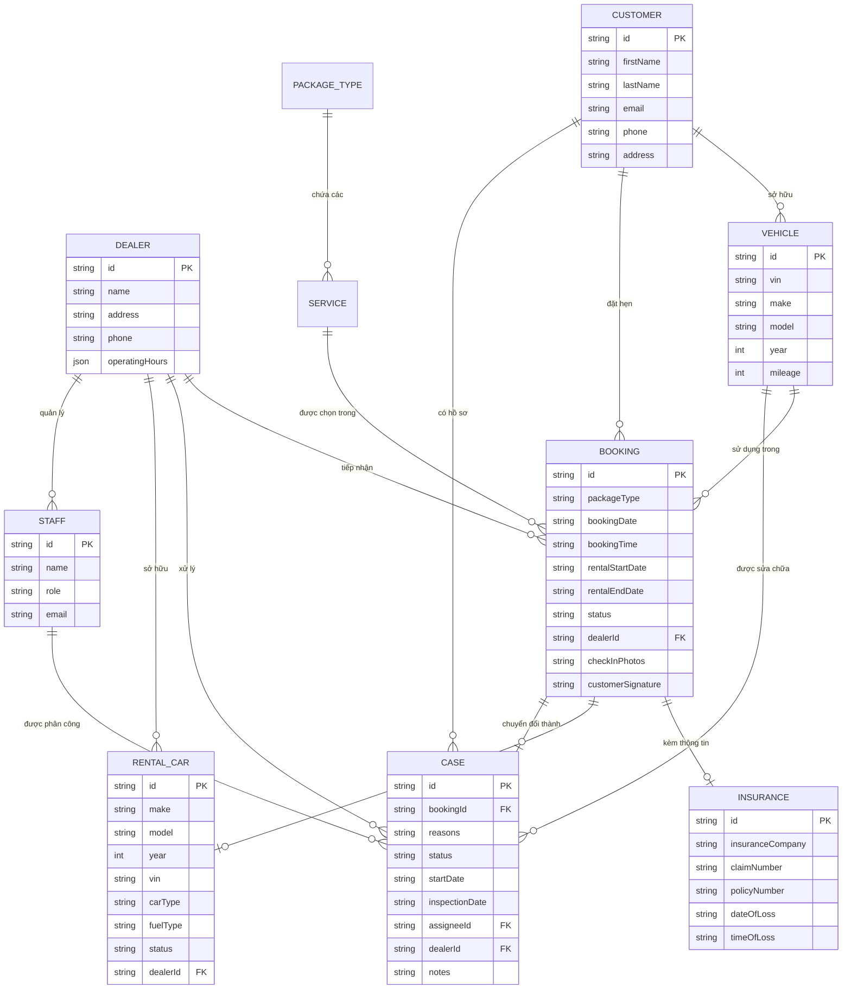

# HƯỚNG DẪN KIẾN TRÚC, CHỨC NĂNG VÀ QUY TRÌNH HỆ THỐNG
## VIETAUTO & LAMBODYAUTO ADMIN DASHBOARD

> [!NOTE]
> Phiên bản tiếng Anh có sẵn tại [SYSTEM_GUIDE_EN.md](file:///d:/VietAuto/admin-dashboard/SYSTEM_GUIDE_EN.md).

---

## MỤC LỤC
1. [Tổng Quan Hệ Thống](#1-tổng-quan-hệ-thống)
2. [Cấu Trúc Các Trang & Chức Năng Chi Tiết](#2-cấu-trúc-các-trang--chức-năng-chi-tiết)
   - 2.1. [Trang Tổng Quan Doanh Thu (Overview - `/`)](#21-trang-tổng-quan-doanh-thu-overview---)
   - 2.2. [Quản Lý Đặt Lịch Hẹn (Bookings - `/bookings`)](#22-quản-lý-đặt-lịch-hẹn-bookings---bookings)
   - 2.3. [Tạo Mới Lịch Hẹn (New Booking - `/bookings/new`)](#23-tạo-mới-lịch-hẹn-new-booking---bookingsnew)
   - 2.4. [Chi Tiết Lịch Hẹn (Booking Detail - `/bookings/[id]`)](#24-chi-tiết-lịch-hẹn-booking-detail---bookingsid)
   - 2.5. [Chỉnh Sửa & Tiếp Nhận Xe (Edit & Check-In - `/bookings/[id]/edit`)](#25-chỉnh-sửa--tiếp-nhận-xe-edit--check-in---bookingsidedit)
   - 2.6. [Quản Lý Hồ Sơ Bồi Thường (Insurance Cases - `/cases`)](#26-quản-lý-hồ-sơ-bồi-thường-insurance-cases---cases)
   - 2.7. [Chi Tiết & Xử Lý Hồ Sơ (Case Detail - `/cases/[id]`)](#27-chi-tiết--xử-lý-hồ-sơ-case-detail---casesid)
   - 2.8. [Quản Lý Khách Hàng (Customers - `/customers`)](#28-quản-lý-khách-hàng-customers---customers)
   - 2.9. [Chi Tiết Khách Hàng & Lịch Sử Xe (Customer Detail - `/customers/[id]`)](#29-chi-tiết-khách-hàng--lịch-sử-xe-customer-detail---customersid)
   - 2.10. [Quản Lý Đội Xe Cho Thuê (Rental Cars - `/rental-cars`)](#210-quản-lý-đội-xe-cho-thuê-rental-cars---rental-cars)
   - 2.11. [Danh Mục Gói & Dịch Vụ (Services - `/services`)](#211-danh-mục-gói--dịch-vụ-services---services)
   - 2.12. [Quản Lý Chi Nhánh Đại Lý (Dealers - `/dealers`)](#212-quản-lý-chi-nhánh-đại-lý-dealers---dealers)
   - 2.13. [Xác Thực & Đăng Nhập (Auth - `/login`)](#213-xác-thực--đăng-nhập-auth---login)
3. [Quy Trình Hoạt Động Cốt Lõi (Core Workflows)](#3-quy-trình-hoạt-động-cốt-lõi-core-workflows)
   - 3.1. [Quy trình Tiếp nhận & Xử lý Lịch hẹn](#31-quy-trình-tiếp-nhận--xử-lý-lịch-hẹn)
   - 3.2. [Quy trình Vòng đời Hồ sơ Bảo hiểm (Insurance Claim Lifecycle)](#32-quy-trình-vòng-đời-hồ-sơ-bảo-hiểm-insurance-claim-lifecycle)
   - 3.3. [Quy trình Thuê xe & Quản lý Đội xe (Rental Fleet Workflow)](#33-quy-trình-thuê-xe--quản-lý-đội-xe-rental-fleet-workflow)
   - 3.4. [Quy trình Phân tích Doanh thu Đa chi nhánh](#34-quy-trình-phân-tích-doanh-thu-đa-chi-nhánh)
4. [Sơ Đồ Mối Quan Hệ Giữa Các Thực Thể (Entity Relations)](#4-sơ-đồ-mối-quan-hệ-giữa-các-thực-thể-entity-relations)
5. [Cơ Chế Phân Trang Tập Trung (Pagination Architecture)](#5-cơ-chế-phân-trang-tập-trung-pagination-architecture)

---

## 1. TỔNG QUAN HỆ THỐNG

Hệ thống **VietAuto Admin Dashboard** là nền tảng quản trị vận hành toàn diện cho mạng lưới xưởng dịch vụ và đại lý ô tô (VietAuto, LamBodyAuto), hỗ trợ 4 mảng nghiệp vụ cốt lõi:
1. **Insurance Claims**: Tiếp nhận và quản lý quy trình bồi thường bảo hiểm ô tô (va chạm, mưa đá, ngập nước, nứt kính, v.v.).
2. **Car Service & Repair**: Đặt lịch và thực hiện sửa chữa, bảo dưỡng cơ khí, điện, máy gầm định kỳ.
3. **Rent a Car**: Quản lý đội xe cho thuê ngắn hạn/dài hạn hoặc xe thay thế trong thời gian sửa chữa bảo hiểm.
4. **Car Detailing**: Chăm sóc xe cao cấp (rửa xe chi tiết, đánh bóng, phủ Ceramic, phục hồi đèn pha).

---

## 2. CẤU TRÚC CÁC TRANG & CHỨC NĂNG CHI TIẾT

```
src/app/
├── (auth)/                               # Giao diện Auth biệt lập (AuthLayout)
│   ├── login/                            # /login: Đăng nhập quản trị viên & quản lý chi nhánh
│   └── register/                         # /register: Đăng ký đại lý mới (tạm ẩn)
└── (dashboard)/                          # Giao diện Dashboard quản trị (DashboardLayout: Sidebar + Navbar)
    ├── page.tsx                          # /: Tổng quan KPI & Doanh thu đa chi nhánh
    ├── bookings/                         # /bookings: Danh sách lịch hẹn đa gói
    │   ├── new/                          # /bookings/new: Wizard tạo lịch hẹn 7 bước
    │   ├── [id]/                         # /bookings/[id]: Chi tiết lịch hẹn
    │   │   └── edit/                     # /bookings/[id]/edit: Sửa thông tin & Check-in xe
    ├── cases/                            # /cases: Danh sách hồ sơ Claim bảo hiểm
    │   └── [id]/                         # /cases/[id]: Chi tiết & Xử lý trực tiếp hồ sơ Claim
    ├── customers/                        # /customers: Danh sách khách hàng
    │   └── [id]/                         # /customers/[id]: Chi tiết khách hàng, xe & lịch sử dịch vụ
    ├── rental-cars/                      # /rental-cars: Đội xe cho thuê & trạng thái hoạt động
    ├── services/                         # /services: Quản lý danh mục gói dịch vụ
    └── dealers/                          # /dealers: Quản lý chi nhánh & giờ mở cửa
```

---

### 2.1. Trang Tổng Quan Doanh Thu (Overview - `/`)
- **Mục đích**: Báo cáo tổng thể sức khỏe tài chính và hoạt động vận hành của toàn bộ hệ thống đại lý.
- **Tính năng chính**:
  - **Bộ chuyển đổi chi nhánh (ShopSwitcher)**: Cho phép xem theo từng đại lý riêng lẻ (`VietAuto`, `LamBodyAuto`) hoặc chế độ tổng hợp **Global Dealer** (cộng dồn toàn hệ thống).
  - **Bộ chỉ số KPI tài chính**:
    - Doanh thu từ dịch vụ Thuê xe (`Car Rental Revenue`).
    - Doanh thu từ Đặt lịch dịch vụ & Sửa chữa (`Booking & Service Revenue`).
    - Doanh thu từ Bồi thường bảo hiểm (`Insurance Claims Revenue`).
    - Tổng doanh thu ròng (`Total Net Revenue`) và tỷ lệ tăng trưởng so với kỳ trước.
  - **Biểu đồ trực quan**:
    - Biểu đồ xu hướng doanh thu theo mốc thời gian (Tuần / Tháng).
    - Biểu đồ phân bổ doanh thu theo từng luồng dịch vụ.
  - **Widget danh sách cảnh báo**:
    - Lịch hẹn sắp đến giờ cần tiếp nhận.
    - Hồ sơ bảo hiểm khẩn cấp hoặc đang bị đình trệ (`Stalled Cases`).

---

### 2.2. Quản Lý Đặt Lịch Hẹn (Bookings - `/bookings`)
- **Mục đích**: Quản lý tập trung tất cả các yêu cầu đặt hẹn dịch vụ thuộc 4 gói chính.
- **Tính năng chính**:
  - **Chuyển Tab theo gói**: *Insurance Claims*, *Car Service & Repair*, *Rent a Car*, *Car Detailing*.
  - **Thanh lọc nâng cao (BookingFilterPanel)**:
    - Tìm kiếm theo: Mã VIN, Số hồ sơ Claim, Ngày tổn thất, Họ tên khách hàng, Tên dòng xe.
    - Lọc theo: Trạng thái lịch hẹn (`Booked In`, `Check In`, `Complete`, `Cancelled`, `Need Estimate`), Hãng bảo hiểm, Loại dịch vụ chi tiết.
  - **Bộ lọc thời gian (TimeFilterPopover)**: Lọc nhanh (Hôm nay, Tuần này, Tháng này, Tất cả) hoặc chọn khoảng ngày cụ thể.
  - **Bảng dữ liệu thích ứng (BookingTable)**: Tự động ẩn/hiện cột thông tin tùy theo gói dịch vụ đang xem (ví dụ: hiển thị hãng bảo hiểm cho gói Claim, hiển thị xe thuê cho gói Rent a Car).
  - **Phân trang chuẩn (Pagination)**: Tự động chia trang mượt mà dựa trên cấu hình tập trung.

---

### 2.3. Tạo Mới Lịch Hẹn (New Booking - `/bookings/new`)
- **Mục đích**: Quy trình Wizard 7 bước linh hoạt để tiếp nhận khách hàng và lên lịch dịch vụ.
- **Quy trình từng bước**:
  1. **Select Service**: Chọn phân loại gói dịch vụ và chọn một hoặc nhiều dịch vụ chi tiết.
  2. **Select Customer**: Chọn khách hàng có sẵn trong hệ thống (hỗ trợ tìm kiếm) hoặc tạo nhanh khách hàng mới ngay tại form.
  3. **Insurance Info** *(chỉ xuất hiện khi chọn gói Insurance Claims)*: Nhập Số Claim, Số Policy, Công ty bảo hiểm, Ngày tổn thất (`dateOfLoss`), và Giờ tổn thất (`timeOfLoss` - tùy chọn).
  4. **Vehicle Info** *(dành cho các gói dịch vụ xe)*: Nhập Số VIN, Hãng xe, Dòng xe, Năm sản xuất, Số dặm đã đi (Odo).
  5. **Select Rental Car** *(chỉ xuất hiện khi chọn gói Rent a Car)*: Chọn xe từ danh sách xe thuê đang sẵn sàng (`Active`).
  6. **Select Date & Time**:
     - *Gói Rent a Car*: Chọn Ngày nhận xe (`rentalStartDate`) và Ngày trả xe (`rentalEndDate`) — không cần chọn giờ hẹn tiếp nhận.
     - *Các gói dịch vụ khác*: Chọn Ngày hẹn (`bookingDate` - Optional) và Giờ hẹn (`bookingTime` - Optional).
  7. **Confirmation**: Kiểm tra lại toàn bộ thông tin đã nhập trước khi hoàn tất lưu vào cơ sở dữ liệu.

---

### 2.4. Chi Tiết Lịch Hẹn (Booking Detail - `/bookings/[id]`)
- **Mục đích**: Xem toàn bộ hồ sơ chi tiết của một lịch hẹn đã tạo.
- **Thông tin hiển thị**:
  - Thông tin khách hàng (Họ tên, Email, SĐT, Địa chỉ).
  - Thông tin gói & danh sách dịch vụ chi tiết.
  - Thông tin phương tiện (Số VIN, Model, Odo).
  - Thông tin bảo hiểm (Hãng, Số Claim, Số Policy, Ngày & Giờ xảy ra tổn thất).
  - Thông tin xe thuê (nếu có).
  - Thông tin lịch hẹn, ảnh chụp tình trạng tiếp nhận xe và chữ ký xác nhận của khách hàng.
  - Nút chuyển nhanh sang trang Chỉnh sửa (`Edit Booking`).

---

### 2.5. Chỉnh Sửa & Tiếp Nhận Xe (Edit & Check-In - `/bookings/[id]/edit`)
- **Mục đích**: Cập nhật thông tin lịch hẹn và thực hiện quy trình bàn giao/tiếp nhận xe vật lý.
- **Cấu trúc 3 Tab**:
  - **Tab 1: Details (Thông tin chung)**: Chỉnh sửa thông tin liên hệ của khách, thông số xe, thông tin bảo hiểm (gồm cả `timeOfLoss`) và ngày giờ hẹn.
  - **Tab 2: Check-In (Tiếp nhận xe)**:
    - Tải lên ảnh chụp thực tế tình trạng ngoại thất, vết móp, vết xước khi nhận xe.
    - **Canvas Chữ ký điện tử**: Cho phép khách hàng ký xác nhận trực tiếp trên màn hình cảm ứng/chuột và lưu chữ ký dưới dạng ảnh.
  - **Tab 3: Status & Deposit**: Đổi trạng thái lịch hẹn và tải lên ảnh séc đặt cọc (`Deposit Check`).

---

### 2.6. Quản Lý Hồ Sơ Bồi Thường (Insurance Cases - `/cases`)
- **Mục đích**: Quản lý vòng đời xử lý hồ sơ Claim với các công ty bảo hiểm.
- **Tính năng chính**:
  - **Thẻ thống kê KPI**: Số hồ sơ đang mở (`Open Cases`), Hồ sơ chờ duyệt (`Pending`), Hồ sơ đình trệ (`Stalled`), và Lợi nhuận ước tính tháng này.
  - **Phân loại Tab trạng thái**: `All`, `Draft` (Hồ sơ nháp), `In Progress` (Đang sửa chữa/giám định), `Complete` (Hoàn tất bồi thường).
  - **Bảng hồ sơ bảo hiểm (CasesTable)**:
    - Xem thông tin xe, bảo hiểm, loại bồi thường (kèm icon trực quan theo loại: Va chạm 🚗, Mưa đá 🌪️, Nứt kính 🪟, v.v.).
    - Đổi trạng thái trực tiếp trên từng hàng mà không cần rời trang.
    - Lọc theo Nhân viên phụ trách (`Staff Assignee`), Hãng xe, Hãng bảo hiểm.
    - Sắp xếp tăng/giảm theo Ngày bắt đầu (`Started Date`) hoặc Ngày giám định (`Inspection Date`).
  - **Modal "New Case"**: Tạo nhanh hồ sơ bồi thường mới bằng cách chọn trực tiếp từ các lịch hẹn bảo hiểm chưa được mở case.

---

### 2.7. Chi Tiết & Xử Lý Hồ Sơ (Case Detail - `/cases/[id]`)
- **Mục đích**: Trung tâm điều phối và theo dõi tiến độ chi tiết từng hồ sơ bồi thường.
- **Tính năng nổi bật**:
  - **Bộ đếm thời gian mở hồ sơ (`Days Open Tracker`)**: Tự động tính toán số ngày hồ sơ đã mở tính đến thời điểm hiện tại và hiển thị badge màu cảnh báo tiến độ.
  - **Chế độ Chỉnh sửa trực tiếp (In-place Edit)**: Nhấn nút Edit để chỉnh sửa trực tiếp nhân viên phụ trách, ngày giám định, trạng thái, và ghi chú nội bộ mà không cần chuyển trang.
  - **Liên kết 2 chiều với Booking**: Bấm vào liên kết `Linked Booking` để mở ngay lịch hẹn gốc tương ứng.

---

### 2.8. Quản Lý Khách Hàng (Customers - `/customers`)
- **Mục đích**: Quản lý danh bạ khách hàng sử dụng dịch vụ tại hệ thống đại lý.
- **Tính năng chính**:
  - Thống kê tổng số khách hàng, tổng số xe đã đăng ký và tổng số lịch hẹn đang kích hoạt.
  - Bảng danh sách khách hàng (Họ tên, SĐT, Email, Địa chỉ, Số lượng xe sở hữu, Số lịch hẹn đã thực hiện).
  - Tìm kiếm nhanh theo tên/SĐT/Email và phân trang dữ liệu.

---

### 2.9. Chi Tiết Khách Hàng & Lịch Sử Xe (Customer Detail - `/customers/[id]`)
- **Mục đích**: Cung cấp góc nhìn 360 độ về một khách hàng cụ thể.
- **Tính năng chính**:
  - Danh sách thẻ phương tiện mà khách hàng sở hữu (Hiển thị VIN, Model, Odo, Số lần vào xưởng, Ngày bảo dưỡng gần nhất).
  - **Bộ lọc tương tác theo xe**:
    - Chọn `"All Vehicles"`: Xem toàn bộ lịch sử lịch hẹn và hồ sơ của khách hàng.
    - Nhấp vào một xe cụ thể: Bảng lịch hẹn và hồ sơ bên dưới sẽ tự động lọc chỉ hiển thị các dịch vụ liên quan đến chiếc xe đó.
  - **Bảng Hồ sơ bảo hiểm của khách**: Hiển thị các case claim liên quan.
  - **Lịch sử thuê xe (`Rental History`)**: Đối với khách hàng từng thuê xe, hiển thị danh sách các xe đã thuê, khoảng thời gian mượn/trả và trạng thái.

---

### 2.10. Quản Lý Đội Xe Cho Thuê (Rental Cars - `/rental-cars`)
- **Mục đích**: Quản lý tài sản xe cho thuê của các đại lý.
- **Tính năng chính**:
  - Lưới thẻ xe (`carGrid`) hiển thị thông số: Phân khúc xe (Sedan, SUV,...), Loại nhiên liệu (Xăng, Điện, Hybrid), Odo, Số VIN, Chi nhánh đại lý quản lý xe.
  - Thêm xe mới vào đội xe cho thuê.
  - Nút chuyển đổi trạng thái 1-click: `Activate` (Sẵn sàng cho thuê) / `Deactivate` (Bảo dưỡng/Tạm ngưng).
  - Bộ lọc theo trạng thái: Tất cả / Đang sẵn sàng / Đang bảo dưỡng.

---

### 2.11. Danh Mục Gói & Dịch Vụ (Services - `/services`)
- **Mục đích**: Cấu hình bảng giá và danh mục dịch vụ chi tiết cho từng gói.
- **Tính năng chính**:
  - Quản lý theo từng gói: *Insurance Claims*, *Car Service & Repair*, *Rent a Car*, *Car Detailing*.
  - Thêm dịch vụ mới nhanh và phân quyền chi nhánh (`VietAuto` / `LamBodyAuto`).
  - Xóa dịch vụ khỏi hệ thống.

---

### 2.12. Quản Lý Chi Nhánh Đại Lý (Dealers - `/dealers`)
- **Mục đích**: Quản lý thông tin chi nhánh và lịch biểu hoạt động.
- **Tính năng chính**:
  - Hiển thị danh sách đại lý (Địa chỉ, Số điện thoại liên hệ).
  - Chỉnh sửa khung giờ mở cửa/đóng cửa chi tiết cho từng ngày trong tuần (Thứ 2 đến Chủ Nhật).
  - Hỗ trợ gạt công tắc đánh dấu ngày nghỉ (`Closed`).

---

### 2.13. Xác Thực & Đăng Nhập (Auth - `/login`)
- **Mục đích**: Cổng đăng nhập bảo mật dành cho ban quản trị và quản lý chi nhánh.
- **Đặc điểm kiến trúc**:
  - Sử dụng **`AuthLayout`** độc lập hoàn toàn với Dashboard: Hero banner giới thiệu giải pháp VietAuto ở bên trái và Form đăng nhập ở bên phải.
  - Tích hợp bộ đổi ngôn ngữ (`EN / VI`) và công tắc `Dark / Light Mode` ngay trên giao diện Auth.
  - **Nút Demo Đăng Nhập Nhanh (1-click)**:
    - `Admin (Global)`: Trải nghiệm vai trò Tổng giám đốc/Admin toàn quyền.
    - `Dealer Manager (Hà Nội)`: Trải nghiệm vai trò Giám đốc chi nhánh.

---

## 3. QUY TRÌNH HOẠT ĐỘNG CỐT LÕI (CORE WORKFLOWS)



---

### 3.1. Quy trình Tiếp nhận & Xử lý Lịch hẹn
1. Nhân viên mở trang **`New Booking`** (`/bookings/new`).
2. Chọn gói dịch vụ và các dịch vụ đi kèm.
3. Chọn khách hàng cũ hoặc nhập thông tin khách hàng mới.
4. Nhập thông tin xe (hoặc chọn xe thuê).
5. Nhập thông tin ngày hẹn tiếp nhận (hoặc khoảng ngày thuê xe).
6. Hệ thống tạo lịch hẹn với trạng thái ban đầu là `Booked In`.
7. Khi khách mang xe đến, nhân viên mở trang `Booking Edit` (`/bookings/[id]/edit`), chụp ảnh ngoại thất xe, cho khách ký xác nhận trên màn hình và chuyển trạng thái sang `Checked In`.

---

### 3.2. Quy trình Vòng đời Hồ sơ Bảo hiểm (Insurance Claim Lifecycle)
1. Lịch hẹn thuộc gói `Insurance Claims` được tạo thành công.
2. Tại trang **`Cases`** (`/cases`), nhân viên bấm `New Case` và chọn lịch hẹn vừa tiếp nhận.
3. Hệ thống sinh ra mã Case ID (ví dụ: `CASE-101`), tự động nạp toàn bộ dữ liệu xe, khách hàng, số Claim, số Policy, ngày & giờ xảy ra tổn thất (`dateOfLoss`, `timeOfLoss`).
4. Quản lý phân công nhân viên (`Staff Assignee`) và đặt ngày giám định với hãng bảo hiểm (`Inspection Date`).
5. Trang **`Case Detail`** (`/cases/[id]`) tự động đếm số ngày mở hồ sơ (`Days Open`) để đốc thúc tiến độ.
6. Sau khi giám định, xưởng tiến hành sửa chữa, cập nhật ghi chú nội bộ (`Internal Notes`).
7. Khi bảo hiểm nghiệm thu và thanh toán, hồ sơ được chuyển sang trạng thái `Complete`.

---

### 3.3. Quy trình Thuê xe & Quản lý Đội xe (Rental Fleet Workflow)
1. Quản lý đại lý cấu hình danh sách xe sẵn sàng tại **`Rental Cars`** (`/rental-cars`).
2. Khi khách hàng cần thuê xe (hoặc mượn xe thay thế trong khi chờ sửa chữa xe tai nạn):
   - Chọn gói `Rent a Car` tại `New Booking`.
   - Chọn chiếc xe khả dụng từ danh sách xe `Active`.
   - Chọn ngày nhận xe và ngày trả xe.
3. Lịch sử mượn/thuê xe này được tự động lưu lại trong hồ sơ chi tiết của khách hàng tại **`Customer Detail`** (`/customers/[id]`), cho phép tra cứu toàn bộ lịch sử thuê xe bất kỳ lúc nào.

---

### 3.4. Quy trình Phân tích Doanh thu Đa chi nhánh
1. Mọi giao dịch hoàn tất từ các mảng (Thuê xe, Bảo dưỡng sửa chữa, Bồi thường bảo hiểm) được đẩy về module doanh thu.
2. Tại trang **`Overview`** (`/`):
   - Lựa chọn `VietAuto`: Xem doanh thu và các chỉ số tài chính riêng của chi nhánh VietAuto.
   - Lựa chọn `LamBodyAuto`: Xem doanh thu riêng của chi nhánh LamBodyAuto.
   - Lựa chọn `Global Dealer`: Hệ thống tự động tổng hợp (roll-up) cộng dồn doanh thu toàn bộ mạng lưới chi nhánh, biểu diễn biểu đồ tăng trưởng và cơ cấu nguồn thu.

---

## 4. SƠ ĐỒ MỐI QUAN HỆ GIỮA CÁC THỰC THỂ (ENTITY RELATIONS)



---

## 5. CƠ CHẾ PHÂN TRANG TẬP TRUNG (PAGINATION ARCHITECTURE)

Hệ thống được thiết kế theo nguyên lý **Single Source of Truth** cho tính năng phân trang:

```
[src/constants/index.ts] ──> DEFAULT_PAGE_SIZE = 10
       │
       ▼
[src/hooks/common/usePagination.ts] ──> Tự động nạp DEFAULT_PAGE_SIZE
       │
       ├─► BookingsPage    : usePagination(bookings)
       ├─► CasesPage       : usePagination(cases)
       ├─► CustomersPage   : usePagination(filteredCustomers)
       ├─► RentalCarsPage  : usePagination(filteredCars)
       ├─► ServicesPage    : usePagination(services)
       └─► DealersPage     : usePagination(dealers)
```

- **Điểm ưu việt**: Khi muốn thay đổi kích thước trang toàn hệ thống (ví dụ từ `10` lên `15` hoặc `20`), bạn chỉ cần thay đổi **đúng 1 dòng** tại [`src/constants/index.ts`](file:///d:/VietAuto/admin-dashboard/src/constants/index.ts). Toàn bộ 6 trang danh sách sẽ tự động nhận kích thước mới mà không cần chỉnh sửa từng tệp.

---
*Tài liệu được biên soạn đồng bộ với phiên bản mã nguồn VietAuto Admin Dashboard.*
