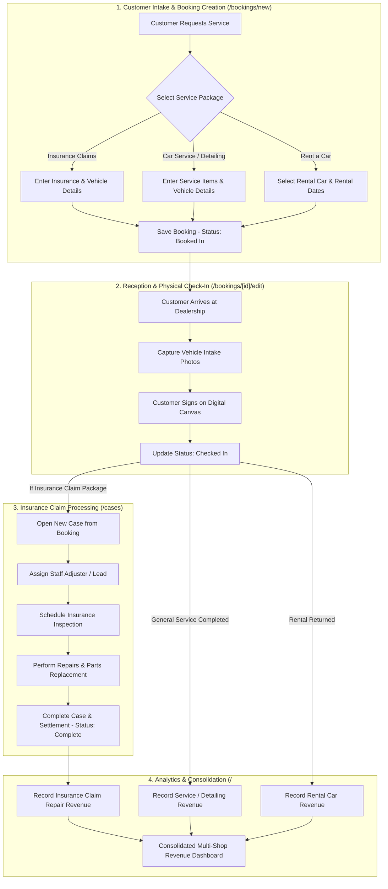
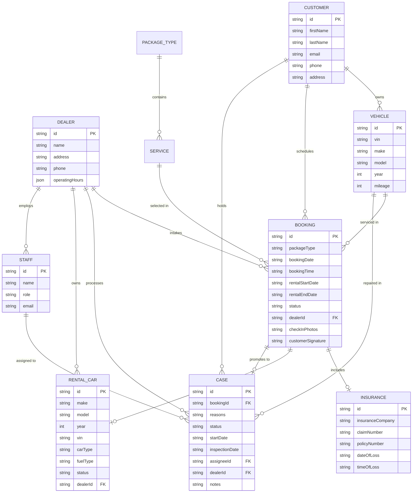

# SYSTEM ARCHITECTURE, FEATURES & WORKFLOW GUIDE
## VIETAUTO & LAMBODYAUTO ADMIN DASHBOARD

> [!NOTE]
> Vietnamese version is available at [SYSTEM_GUIDE.md](file:///d:/VietAuto/admin-dashboard/SYSTEM_GUIDE.md).

---

## TABLE OF CONTENTS
1. [System Overview](#1-system-overview)
2. [Pages & Detailed Features](#2-pages--detailed-features)
   - 2.1. [Revenue & Operational Overview (`/`)](#21-revenue--operational-overview--)
   - 2.2. [Bookings Management (`/bookings`)](#22-bookings-management---bookings)
   - 2.3. [New Booking Intake Wizard (`/bookings/new`)](#23-new-booking-intake-wizard---bookingsnew)
   - 2.4. [Booking Detail View (`/bookings/[id]`)](#24-booking-detail-view---bookingsid)
   - 2.5. [Booking Edit & Physical Check-In (`/bookings/[id]/edit`)](#25-booking-edit--physical-check-in---bookingsidedit)
   - 2.6. [Insurance Claims Management (`/cases`)](#26-insurance-claims-management---cases)
   - 2.7. [Case Detail & In-Place Processing (`/cases/[id]`)](#27-case-detail--in-place-processing---casesid)
   - 2.8. [Customer Directory (`/customers`)](#28-customer-directory---customers)
   - 2.9. [Customer 360 & Vehicle History (`/customers/[id]`)](#29-customer-360--vehicle-history---customersid)
   - 2.10. [Rental Fleet Management (`/rental-cars`)](#210-rental-fleet-management---rental-cars)
   - 2.11. [Packages & Services Catalog (`/services`)](#211-packages--services-catalog---services)
   - 2.12. [Dealership Locations & Schedules (`/dealers`)](#212-dealership-locations--schedules---dealers)
   - 2.13. [Authentication & Access Control (`/login`)](#213-authentication--access-control---login)
3. [Core Operational Workflows](#3-core-operational-workflows)
   - 3.1. [Customer Intake & Physical Check-In Workflow](#31-customer-intake--physical-check-in-workflow)
   - 3.2. [Insurance Claim Lifecycle Workflow](#32-insurance-claim-lifecycle-workflow)
   - 3.3. [Rental Car & Replacement Fleet Workflow](#33-rental-car--replacement-fleet-workflow)
   - 3.4. [Multi-Dealership Revenue Consolidation](#34-multi-dealership-revenue-consolidation)
4. [Entity Relationship Diagram (ERD)](#4-entity-relationship-diagram-erd)
5. [Centralized Pagination Architecture](#5-centralized-pagination-architecture)

---

## 1. SYSTEM OVERVIEW

The **VietAuto Admin Dashboard** is an enterprise operations and business management platform designed for multi-shop auto service networks (VietAuto, LamBodyAuto), covering 4 core service packages:
1. **Insurance Claims**: End-to-end management of auto insurance repair claims (collision, hail damage, comprehensive, windshield replacement, flooding).
2. **Car Service & Repair**: Scheduled routine maintenance, mechanical inspections, brake repairs, oil changes, engine diagnostics.
3. **Rent a Car**: Short-term, weekly, monthly car rentals and insurance replacement loaner vehicles.
4. **Car Detailing**: Premium cosmetic care (deep interior cleaning, multi-stage paint correction, ceramic coatings, headlight restoration).

---

## 2. PAGES & DETAILED FEATURES

```
src/app/
├── (auth)/                               # Isolated Auth Route Group (AuthLayout)
│   ├── login/                            # /login: Administrator & Dealer Manager Login
│   └── register/                         # /register: New Dealership Onboarding (Temporarily hidden)
└── (dashboard)/                          # Main Management Workspace (DashboardLayout)
    ├── page.tsx                          # /: Financial KPIs & Multi-Dealer Revenue Analytics
    ├── bookings/                         # /bookings: Multi-package Booking Directory
    │   ├── new/                          # /bookings/new: 7-Step Booking Intake Wizard
    │   ├── [id]/                         # /bookings/[id]: Booking Comprehensive Inspection
    │   │   └── edit/                     # /bookings/[id]/edit: Intake Photos & Digital Signature Pad
    ├── cases/                            # /cases: Insurance Claim Kanban & Tracker Table
    │   └── [id]/                         # /cases/[id]: Claim Lifecycle Tracker & In-Place Editor
    ├── customers/                        # /customers: Customer Directory
    │   └── [id]/                         # /customers/[id]: Customer 360, Vehicles & Service History
    ├── rental-cars/                      # /rental-cars: Rental Fleet & Vehicle Statuses
    ├── services/                         # /services: Package & Service Catalog Configuration
    └── dealers/                          # /dealers: Dealership Profiles & Operating Hours
```

---

### 2.1. Revenue & Operational Overview (`/`)
- **Purpose**: High-level financial reporting, KPI monitoring, and operational intelligence.
- **Key Features**:
  - **Dealership Switcher (`ShopSwitcher`)**: Toggle between individual dealerships (`VietAuto`, `LamBodyAuto`) or consolidated **Global Dealer** mode.
  - **Financial Metrics Cards**:
    - Car Rental Revenue stream.
    - Booking & General Service Revenue stream.
    - Insurance Claims Repair Revenue stream.
    - Consolidated Total Net Revenue and period-over-period growth rates.
  - **Interactive Charts**:
    - Revenue trend charts with weekly/monthly granularity.
    - Package revenue distribution breakdown.
  - **Operational Action Widgets**:
    - Upcoming bookings requiring physical reception.
    - Critical and stalled insurance claims needing urgent adjuster follow-ups.

---

### 2.2. Bookings Management (`/bookings`)
- **Purpose**: Centralized booking command center across all 4 service packages.
- **Key Features**:
  - **Package Tabs**: *Insurance Claims*, *Car Service & Repair*, *Rent a Car*, *Car Detailing*.
  - **Advanced Filter Drawer (`BookingFilterPanel`)**:
    - Search by: VIN, Insurance Claim Number, Date of Loss, Customer Name, Vehicle Model.
    - Filter by: Booking Status (`Booked In`, `Check In`, `Complete`, `Cancelled`, `Need Estimate`), Insurance Carrier, Service Name.
  - **Time Filter Popover (`TimeFilterPopover`)**: Quick filters (Today, This Week, This Month, All Time) or custom date range selection.
  - **Adaptive Table (`BookingTable`)**: Dynamically shows/hides columns relevant to the selected package (e.g., Insurance Carrier for Claims, Rental Car selection for Rent a Car).
  - **Centralized Pagination**: Seamless page navigation honoring global page size configuration.

---

### 2.3. New Booking Intake Wizard (`/bookings/new`)
- **Purpose**: Guided 7-step wizard for customer reception and service scheduling.
- **Step-by-Step Breakdown**:
  1. **Select Service**: Choose package classification and one or multiple specific service items.
  2. **Select Customer**: Search and pick an existing customer or create a new customer record on-the-fly.
  3. **Insurance Info** *(Only active for Insurance Claims package)*: Enter Claim Number, Policy Number, Insurance Company, Date of Loss (`dateOfLoss`), and optional Time of Loss (`timeOfLoss`).
  4. **Vehicle Info** *(Active for all physical service packages)*: Enter VIN, Make, Model, Year, Mileage.
  5. **Select Rental Car** *(Only active for Rent a Car package)*: Select an available active vehicle from the rental fleet.
  6. **Select Date & Time**:
     - *Rent a Car*: Select Pick-up Date (`rentalStartDate`) and Drop-off Date (`rentalEndDate`) without requiring time slots.
     - *Other Packages*: Select Appointment Date (`bookingDate` - Optional) and Time Slot (`bookingTime` - Optional).
  7. **Confirmation**: Comprehensive summary review before persistent database submission.

---

### 2.4. Booking Detail View (`/bookings/[id]`)
- **Purpose**: Read-only master inspection view of a booking record.
- **Displayed Data**:
  - Customer contact details (Name, Phone, Email, Address).
  - Package category & detailed service lines.
  - Vehicle specifications (VIN, Model, Mileage).
  - Insurance information with `timeOfLoss`.
  - Assigned rental vehicle (if applicable).
  - Physical check-in photos and digitized customer signature.
  - Quick action to navigate to Edit Mode or linked Insurance Claim Case.

---

### 2.5. Booking Edit & Physical Check-In (`/bookings/[id]/edit`)
- **Purpose**: Modify booking records and execute vehicle intake upon arrival.
- **3-Tab Architecture**:
  - **Tab 1: Details**: Edit customer details, vehicle specs, insurance metadata (including `timeOfLoss`), and appointment scheduling.
  - **Tab 2: Check-In**:
    - Upload exterior condition photos capturing scratches, dents, or pre-existing damage.
    - **Digital Canvas Signature Pad**: Real-time touch/mouse signature capturing and export.
  - **Tab 3: Status & Deposit**: Update operational status and upload deposit check documentation.

---

### 2.6. Insurance Claims Management (`/cases`)
- **Purpose**: Insurance claim lifecycle tracker and workflow pipeline.
- **Key Features**:
  - **KPI Header**: Open Cases count, Pending Cases, Stalled Cases, and Estimated Monthly Profit.
  - **Category Tabs**: `All`, `Draft`, `In Progress`, `Complete`.
  - **Claims Table (`CasesTable`)**:
    - Visual claim reason icons (🚗 Collision, 🌪️ Hail Damage, 🪟 Windshield, etc.).
    - Direct inline status change dropdown.
    - Filter by Staff Assignee, Vehicle Make, and Insurance Carrier.
    - Sort ascending/descending by Started Date or Inspection Date.
  - **New Case Modal**: 1-click modal to open a new claim case directly from unprocessed insurance bookings.

---

### 2.7. Case Detail & In-Place Processing (`/cases/[id]`)
- **Purpose**: Deep claim case inspection, adjuster coordination, and repair tracking.
- **Key Highlights**:
  - **Days Open Counter**: Dynamically tracks elapsed days from case inception to today with visual status badges.
  - **In-Place Editing**: Instant editing mode for Assignee, Inspection Date, Claim Status, and Internal Staff Notes without page reload.
  - **Bidirectional Linking**: Instant 1-click jump back to the original booking record.

---

### 2.8. Customer Directory (`/customers`)
- **Purpose**: Centralized customer relationship management.
- **Key Features**:
  - Aggregated metrics: Total Customers, Total Registered Vehicles, Active Service Bookings.
  - Interactive search bar (Name, Phone, Email) with instant clearing.
  - Customer table displaying vehicles count and lifetime booking history.

---

### 2.9. Customer 360 & Vehicle History (`/customers/[id]`)
- **Purpose**: Complete 360-degree customer profile and historical vehicle log.
- **Key Features**:
  - Vehicle ownership card collection (VIN, Model, Odometer, Visit count, Last serviced date).
  - **Interactive Vehicle Filter**:
    - Click `"All Vehicles"` to view all lifetime bookings and cases for the customer.
    - Click any specific vehicle card to automatically filter tables to only show records for that particular vehicle.
  - **Service Bookings Table**: Full historical log of all customer appointments.
  - **Insurance Cases Table**: Associated insurance claim records.
  - **Rental History List (`CustomerRentalHistoryItem`)**: Complete log of borrowed/rented loaner cars and rental durations.

---

### 2.10. Rental Fleet Management (`/rental-cars`)
- **Purpose**: Asset management for dealership rental and loaner vehicle fleet.
- **Key Features**:
  - Responsive card grid displaying vehicle specs: Body Type, Fuel Type, Mileage, VIN, Assigned Dealership.
  - 1-click Status Toggle (`Activate` / `Deactivate`).
  - Add New Vehicle form with VIN and mileage validation.
  - Status filter buttons (*All, Active, Inactive*).

---

### 2.11. Packages & Services Catalog (`/services`)
- **Purpose**: Service catalog pricing and service offering configuration.
- **Key Features**:
  - Tabbed organization by package (*Insurance Claims, Car Service & Repair, Rent a Car, Car Detailing*).
  - Add custom services with dealership attribution (`VietAuto` / `LamBodyAuto`).
  - Remove deprecated services.

---

### 2.12. Dealership Locations & Schedules (`/dealers`)
- **Purpose**: Dealership branch profile and operating hours configuration.
- **Key Features**:
  - Dealership contact profiles (Address, Phone number).
  - Day-by-day weekly operating hours editor (Monday through Sunday).
  - Support for `Closed` day toggles and custom opening/closing time inputs.

---

### 2.13. Authentication & Access Control (`/login`)
- **Purpose**: Secure authentication portal for dealership staff and corporate executives.
- **Architectural Highlights**:
  - Clean split **`AuthLayout`** with brand illustration pane and authentication form.
  - Integrated Language Switcher (`EN / VI`) and Dark/Light Mode toggle.
  - **1-Click Demo Login Selector**:
    - `Admin (Global)`: Full enterprise administrator privileges across all dealerships.
    - `Dealer Manager (Hanoi)`: Branch manager scope.

---

## 3. CORE OPERATIONAL WORKFLOWS



---

### 3.1. Customer Intake & Physical Check-In Workflow
1. Staff opens **`New Booking`** (`/bookings/new`).
2. Selects service package and specific service lines.
3. Selects existing customer or enters new customer details.
4. Enters vehicle specifications (or selects rental car).
5. Schedules appointment date and time (or rental start/end dates).
6. Booking is created with initial status `Booked In`.
7. Upon vehicle arrival at the shop, staff opens `Booking Edit` (`/bookings/[id]/edit`), captures exterior photos, obtains customer digital signature, and updates status to `Checked In`.

---

### 3.2. Insurance Claim Lifecycle Workflow
1. A booking under `Insurance Claims` package is completed.
2. Under **`Cases`** (`/cases`), staff clicks `New Case` and selects the booking.
3. The system generates a Case ID (e.g., `CASE-101`), pre-populating vehicle, customer, Claim #, Policy #, and Date/Time of Loss (`dateOfLoss`, `timeOfLoss`).
4. Manager assigns a `Staff Assignee` and schedules an `Inspection Date` with the insurance adjuster.
5. The **`Case Detail`** (`/cases/[id]`) page dynamically calculates and highlights `Days Open` to track repair velocity.
6. Following adjuster approval, technicians complete repair work and log internal notes.
7. Upon insurance payout, the case status is marked as `Complete`.

---

### 3.3. Rental Car & Replacement Fleet Workflow
1. Dealership manager provisions vehicles under **`Rental Cars`** (`/rental-cars`).
2. When a customer requires a rental or insurance replacement loaner:
   - Select `Rent a Car` package in `New Booking`.
   - Select an available `Active` vehicle.
   - Choose pickup and drop-off dates.
3. This rental history is permanently linked to the customer profile under **`Customer Detail`** (`/customers/[id]`) for auditability.

---

### 3.4. Multi-Dealership Revenue Consolidation
1. Completed transactions across all revenue streams (Rentals, Mechanical Repairs, Insurance Claims) feed into the analytics pipeline.
2. In **`Overview`** (`/`):
   - Selecting `VietAuto` isolates Hanoi branch figures.
   - Selecting `LamBodyAuto` isolates Saigon branch figures.
   - Selecting `Global Dealer` aggregates figures across all locations into unified KPI cards and charts.

---

## 4. ENTITY RELATIONSHIP DIAGRAM (ERD)



---

## 5. CENTRALIZED PAGINATION ARCHITECTURE

The system implements the **Single Source of Truth** design principle for pagination across all data views:

```
[src/constants/index.ts] ──> DEFAULT_PAGE_SIZE = 10
       │
       ▼
[src/hooks/common/usePagination.ts] ──> Ingests DEFAULT_PAGE_SIZE
       │
       ├─► BookingsPage    : usePagination(bookings)
       ├─► CasesPage       : usePagination(cases)
       ├─► CustomersPage   : usePagination(filteredCustomers)
       ├─► RentalCarsPage  : usePagination(filteredCars)
       ├─► ServicesPage    : usePagination(services)
       └─► DealersPage     : usePagination(dealers)
```

- **Benefit**: To adjust the page size across the entire application (e.g. from `10` to `15` or `20`), modify **only 1 line** in [`src/constants/index.ts`](file:///d:/VietAuto/admin-dashboard/src/constants/index.ts). All 6 listing pages will immediately synchronize without individual file modifications.

---
*Document synchronized with VietAuto Admin Dashboard codebase.*
